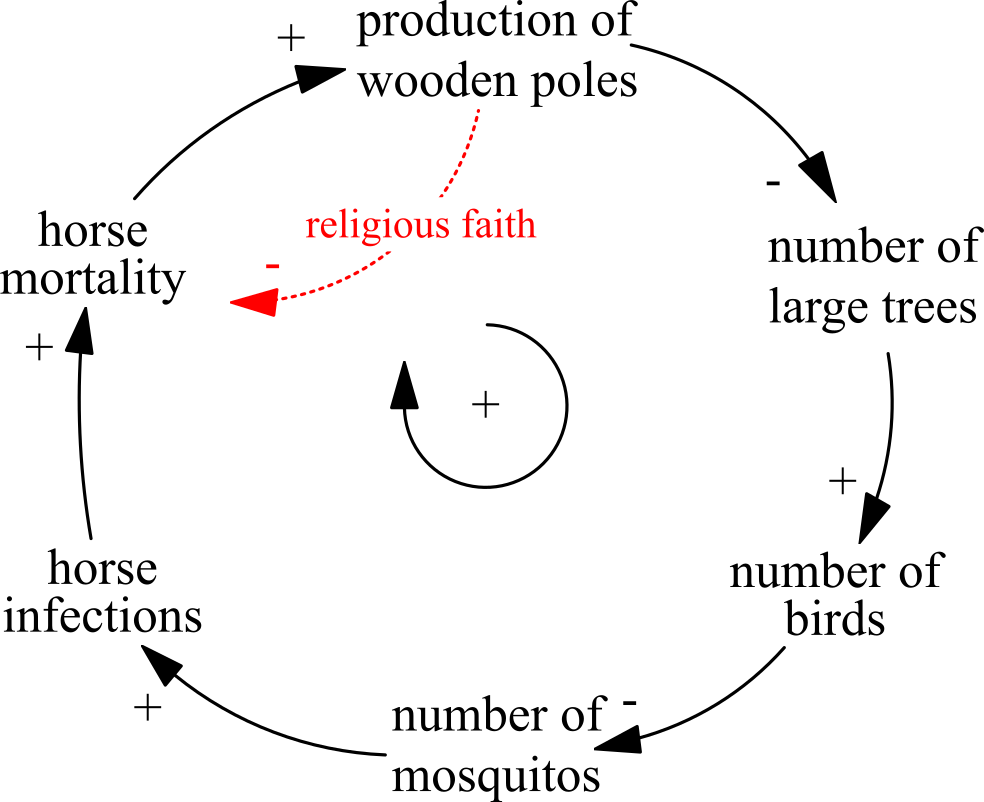

# Debriefing

## Game's Solution

The game introduces to a story about an island community that exploits a slowly-renewable resource. This story was inspired by Jared Diamonds book chapter on the environmental collapse of Easter Island [@diamond2005collapse].

The fictitious island in EQUILIBRIUM is located somewhere close to the east coast of New Zealand. The island is habitat to a number of colorful singing birds. These birds feed on mosquitos, which in turn subsist on the blood of larger mammals like horses. Mosquitos also disseminate a viral disease that threatens the domesticated horse population on the island.

The island's community strongly relies on the export of racehorses to the mainland. Apart from horse breeding, also a small timber industry developed on the island. In contrast to the horse breeding economy, the timber economy is primarily a closed system, meaning that timber is neither exported nor imported. 

Horse and timber economies are two parts of a coupled system. These sub-systems are linked through religious faith and practices of the islanders: Horse farmers raise large wooden poles as a kind of mojo, which they obtain from local artists. These artists, in turn, receive timber raw materials from lumberjacks.

As more and more large trees fall victim to the production of wooden poles, singing birds suffer from a significant shortage of breeding sites. Birds need sufficiently large trees for building nests for their offspring, otherwise squeakers get caught by predators. As a result of this shortage, the bird population diminishes. This especially benefits mosquitos, which spread out and exploit new habitats. This in turn cause the number of viral infections to increase. The islanders are unaware of these mechanisms and respond by raising even more poles made from wood.

```{r echo=FALSE, fig21, fig.cap="Self-enforcing (positive) loop that acts as a key driver in this system", out.width='45%', fig.asp=.75, fig.align='center'}

```

This self-enforcing loop causes a continuous increase of horse mortality rates, which eventually forces horse breeders to emigrate. Timber workers followed shortly after, due to lacking demand for their product [Fig. \@ref(fig:fig21)].

Also the established policy of re-planting one seedling for each mature tree that is harvested eventually turns out to be ineffective. In order to preserve the ecological equilibrium, the number of large/mature trees is to be maintained on a high level. The re-planting policy, however, leads to long-term depletion of mature tree stocks, before first seedlings reach maturity [@richmond2001introduction]. The time it takes before the implemented policy balances out tree logging activities, is equivalent to the time it takes for the tree seedling to grow to maturity (about 100 years in EQUILIBRIUM). Up to this point, mature tree stocks on the island continue to diminish [Fig. \@ref(fig:fig22)].

```{r echo = FALSE, fig22, fig.cap='Impact of replanting policy', out.width='80%', fig.asp=.75, fig.align='center'}
# Line Data
x <- c(0, 20, 120, 180)
y <- c(1000, 1000, 400, 400)


# get the range for the x and y axis
xrange <- range(0:180)
yrange <- range(0:1100)

# set up the plot
plot(xrange, yrange, type="n", xlab="Time (years)",
   ylab="Number of large trees (> 100 years)" )
colors <- rainbow(6)
#linetype <- c(1)

# add line
lines(x, y, lwd=1.5, col=colors) #type="b",lty=linetype, 

#Draw arrow and description
arrows(20, 700, 20, 1000)
text(20, 600, labels = "Policy \n is implemented")
arrows(120, 700, 120, 400)
text(120, 800, labels = "System is in balance \n after 100 years")
```
##Literature
